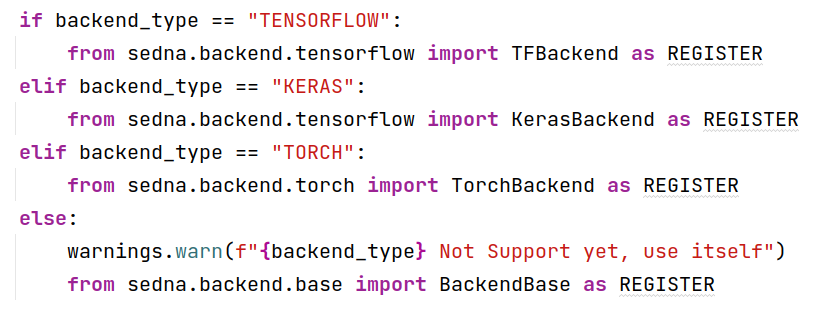

#  Implement Sedna Python SDK support TinyMS
# 1. Project Background
## 1.1 Project Background

Sedna is an edge-cloud synergy AI project incubated in KubeEdge SIG AI. Benefiting from the edge-cloud synergy capabilities provided by KubeEdge, Sedna can implement across edge-cloud collaborative training and collaborative inference capabilities, such as joint inference, incremental learning, federated learning, and lifelong learning. Sedna supports popular AI frameworks, such as TensorFlow, Pytorch, PaddlePaddle, and MindSpore.

Sedna can simply enable edge-cloud synergy capabilities to existing training and inference scripts, bringing the benefits of reducing costs, improving model performance, and protecting data privacy.

## 1.2 Project Pain Points

Currently, Sedna only supports sklearn's xgboost, Tensorflow, Keras and MindSpore, but doesn’t support MindSpore’s high-level API tool TinyMS.

This project aims to implement Senda Python SDK ‘s support for TinyMS based on  Sedna's lib development interface and implements an Incremental Learning demo.

## 1.3 Project Goals

- Implement Sedna Python SDK support of TinyMS
- Design Incremental Learning demo
- Write related documentation: usage documentation, use case reports
- Submit the pull request to the repo
- Successfully merge to KubeEdge/Sedna

# 2. Proposals

## 2.1 Sedna Architecture analysis


Taking the case yolo3 incremental learning in Sedna as an example, the user wraps the estimator for the specific model. when the incremental learning interface `IncrementalLearning()` is called, the following process takes place:

- IncrementalLearning instantiates its parent class JobBase.
- Call `set_backend()` in the constructor of JobBase to resolve the framework used by the model to TensorFlow and instantiate the corresponding TFBackend.

- TFBackend inherits BackendBase, which is initialized with OS-related configuration when instantiated.

- TFBackend implements the specific framework-related configuration.

## 2.2 Feasibility

Sedna parses the underlying framework of the model and runs the model using a different machine learning framework through a backend pair. So we need to :

- implement Sedna's parsing of the underlying machining learning framework 



- implement TinyMSBackend

# 3. Design details

## 3.1 set_backend()  

Improve function `set_backend()` in `sedna/backend/__init__.py`

```python
if backend_type == "TINYMS":
	from sedna.backend.tinyms import TinyMSBackend as REGISTER
```

## 3.2 TInyMS API

TinyMS is MindSpore's high-level API, but the TinyMS’s methods are not the same as the MindSpore framework’s , so we can not use the idea of inheritance for encapsulation.

`TinyMSBackend`class

-  `__init__(self, estimator, fine_tune=True, **kwargs) `  ：initialize

-  `train(self, train_data, valid_data=None, **kwargs)`: train the model

-  `predict(self, data, **kwargs) `: use the model to preidct result

-  `evaluate(self, data, **kwargs)`: evaluate the accuracy

-  `load_weights(self)`: load model weight

-  `get_weights(self) `：return weight

-  `set_weights(self, weights) `：set weight

```python
class TinyMSBackend(MSBackend):
	def __init__(self, estimator, fine_tune=True, **kwargs):
    ...
	
    def train(self, train_data, valid_data=None, **kwargs):
    ...
    
    def predict(self, data, **kwargs):
    ...
    
    def evaluate(self, data, **kwargs):
    ...
    
    def load_weights(self):
	...
    
    def get_weights(self):
	...
	
	def set_weights(self, weights):
	...
```

## 3.3 Demo

The demo will solve [dog and croissant classification task based on MobileNetV2](https://www.mindspore.cn/tutorials/zh-CN/r1.7/beginner/infer.html)

### 3.3.1 Based on MSBackend

- [implement MobileNetV2 with MindSpore](https://www.mindspore.cn/tutorial/zh-CN/r0.7/advanced_use/mobilenetv2_incremental_learning.html)

- Build an estimator class based on MobileNetV2, encapsulating a series of methods such as `train(),evaluate(),predict()`, etc.
- Call incremental learning API to accomplish model training, evaluation, and inference

### 3.3.2 Based on TinyMSBackend

- [implement MobileNetV2 with TinyMS](https://tinyms.readthedocs.io/en/latest/tutorials/ipynb/TinyMS_MobileNetV2_tutorial.html)

- Build an estimator class based on MobileNetV2, encapsulating a series of methods such as `train(),evaluate(),predict()`, etc.

- Call incremental learning API to accomplish model training, evaluation and inference

# 4. Road Map

- Implementing an incremental learning demo based on MSBackend
- [ ] week1 : implement `estimator`
- [ ] week2 : debug model

- TinyMS（08/8-09/16）

- [ ] week3 : learn `TinyMS`documentation
- [ ] week4 : implement `TinyMSBackend` class
- [ ] week5 : implement `estimator`
- [ ] week6 : debug model

- Write documentation（09/17-09/30）

- [ ] week7 : write API documentation
- [ ] week8 : write demo documentation and submit PR

